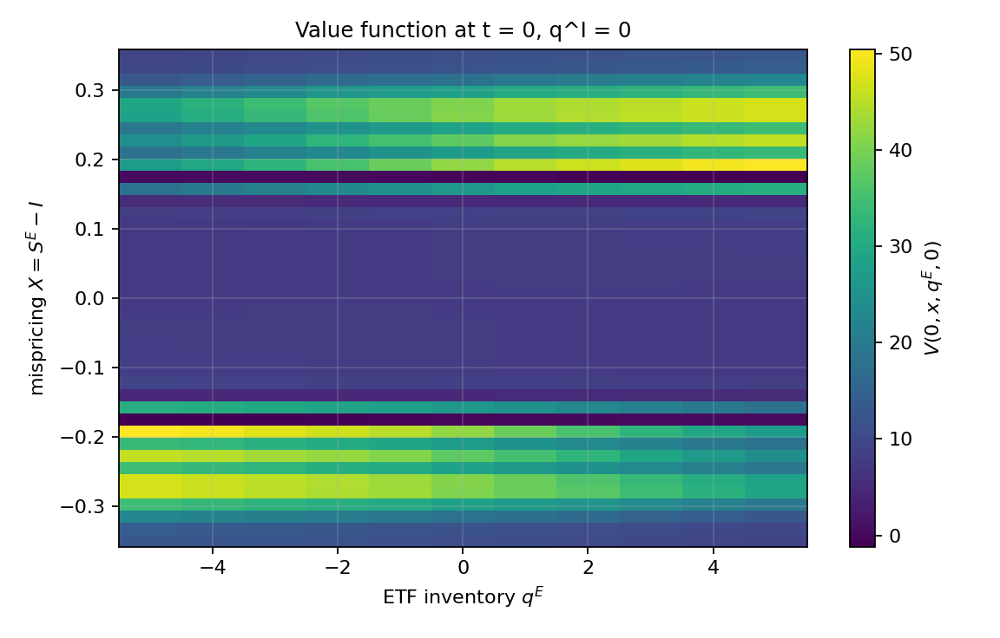
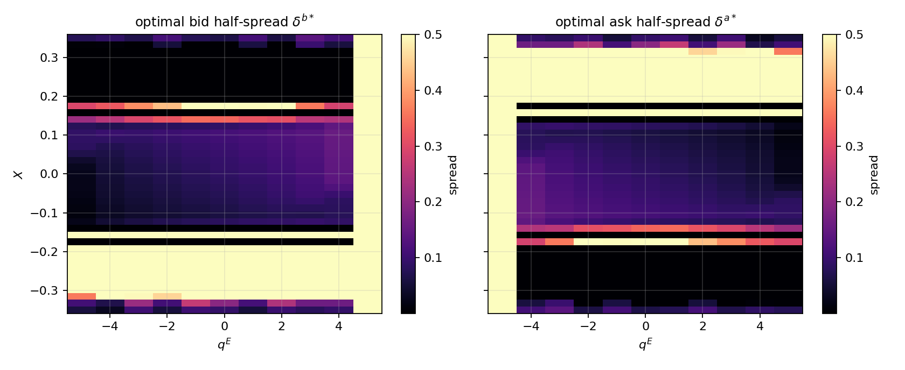
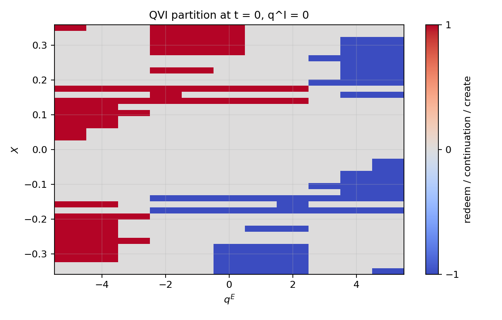
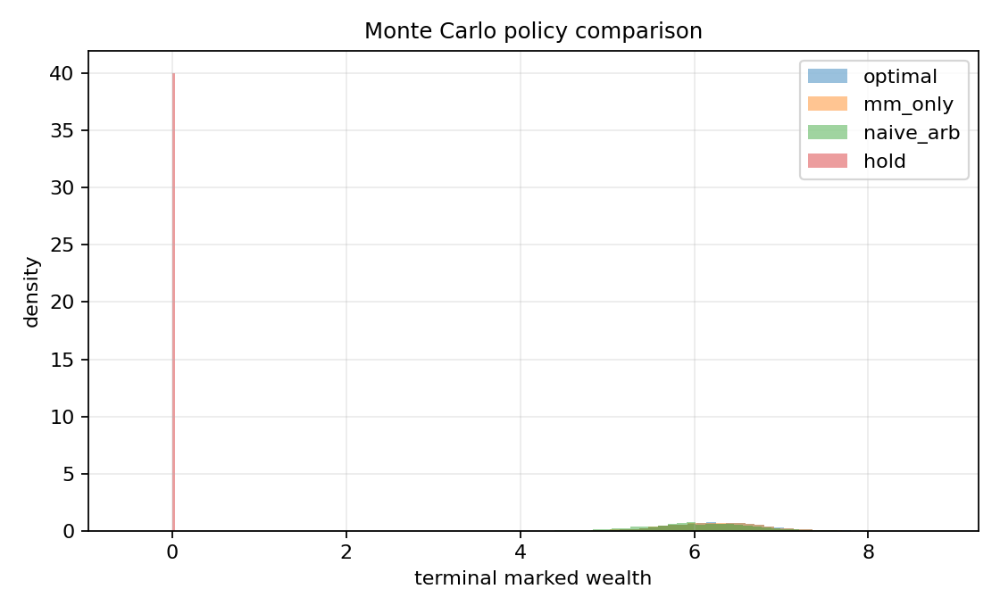

# ETF Authorized-Participant Control: HJB-QVI

Finite-horizon optimal market making, basket hedging, and creation/redemption
for an ETF authorized participant.  The state is the Ornstein–Uhlenbeck ETF
basis $X_t = S_t^E - I_t$ together with integer inventories $(q^E, q^I)$.
Regular controls are Avellaneda–Stoikov half-spreads and a quadratic-impact
hedge rate; impulse controls are creation/redemption blocks of size $K$.

This is a **research implementation of a stochastic-control problem**, not a
trading system.  The point of the repository is that the first-order
conditions are proved, the QVI is discretised monotonically, the scheme is
tested, and the feedback policy is evaluated in a seeded Monte Carlo horse
race against nested baselines.  See [`docs/03-proofs.md`](docs/03-proofs.md).

```
quotes (δᵇ, δᵃ)     hedge rate ν      create / redeem ±K
        │                  │                    │
        ▼                  ▼                    ▼
   Poisson fills      temporary impact     impulse QVI
        │                  │                    │
        └────────────►  state (X, qᴱ, qᴵ)  ◄────┘
                              │
                    IMEX HJB + projection
```

## Model

The ETF–NAV basis is an Ornstein–Uhlenbeck process.  The AP posts half-spreads
$(\delta^b,\delta^a)$, hedges the basket at rate $\nu$, and may create or
redeem a block of size $K$:

$$
\begin{aligned}
dX_t &= -\kappa X_t\,dt + \sigma_X\,dW_t, \\
\lambda(\delta) &= A e^{-k\delta}, \\
\psi(\nu) &= \eta\nu^2.
\end{aligned}
$$

A bid fill buys one ETF (cash $\delta^b-X$); an ask fill sells one ETF
(cash $\delta^a+X$).  Creation maps $(q^E,q^I)\mapsto(q^E+K,q^I-K)$ at fee
$C_{\mathrm{fee}}$; redemption is the reverse swap.

## Why the Hamiltonian signs are not the ones in a naive write-up

A bid fill **buys** one ETF share.  Marked at NAV, cash moves by $\delta^b - X$.
An ask fill **sells** one ETF share and cash moves by $\delta^a + X$.  The
unconstrained maximisers (Theorem 1 in [`docs/03-proofs.md`](docs/03-proofs.md))
are therefore

$$
\begin{aligned}
\delta^{b\star}
&= \frac{1}{k} + X - \Delta_{q^E}^{+} V, \\
\delta^{a\star}
&= \frac{1}{k} - X - \Delta_{q^E}^{-} V, \\
\nu^{\star}
&= \frac{1}{2\eta}\,\partial_{q^I} V.
\end{aligned}
$$

The alternative Hamiltonian $\lambda(\delta)(\Delta V + X - \delta)$ has
critical point $\delta^\star = \Delta V + X + 1/k$ and **post-optimality fill
value $-1/k < 0$**.  That cannot be a maximum of a market-making objective:
the desk would post $\delta_{\max}$ and collect nothing rather than
systematically fill at a sure loss.  The solver implements the version whose
optimised fill value is $+1/k$.

The QVI is

$$
\max\Bigl\{
  \partial_t V + \mathcal{L}^{\delta^{\star},\nu^{\star}}V
    - \phi\bigl((q^E)^2+(q^I)^2\bigr),\;
  \mathcal{M}_c V - V,\;
  \mathcal{M}_r V - V
\Bigr\} = 0,
$$

solved **backward** from $V(T)=0$.  A forward IMEX stencil on a terminal-value
HJB is the heat equation run backwards and is not used here.
Full derivation: [`docs/02-hjb-qvi.md`](docs/02-hjb-qvi.md),
[`docs/04-numerics.md`](docs/04-numerics.md).

## Layout

| path | what it is |
|---|---|
| [`etf_ap/`](etf_ap/) | Python solver, analytics, Monte Carlo, plots |
| [`cpp/include/etf_ap/solver.hpp`](cpp/include/etf_ap/solver.hpp) | same IMEX–QVI split in C++17 |
| [`docs/`](docs/) | model, QVI, proofs, scheme, experiment protocol |
| [`scripts/run_experiments.py`](scripts/run_experiments.py) | paper run + figures + `results/metrics.json` |
| [`scripts/run_convergence.py`](scripts/run_convergence.py) | observed order in $V(0,0,0,0)$ |
| [`tests/`](tests/) | FOCs, monotonicity, parity, economic region tests |

## Run

Python 3.10+.  From the repo root:

```bash
python -m pip install -e ".[dev]"
python -m pytest -q
python scripts/run_experiments.py --profile paper --paths 4000
python scripts/run_convergence.py
```

C++ twin (optional):

```bash
cmake -S . -B build -DCMAKE_BUILD_TYPE=Release
cmake --build build --config Release
./build/etf_ap_solve
```

On Windows the executable is `build\Release\etf_ap_solve.exe` (or
`build\etf_ap_solve.exe` with Ninja).

## What the figures are supposed to show

After `run_experiments.py`, look at `results/figures/` in this order:

1. **Value function** $V(0,x,q^E,0)$ — option value on $|X|$, inventory
   penalty in $|q^E|$, even under $(x,q^E)\mapsto(-x,-q^E)$.
2. **Optimal half-spreads** — bid widens when the ETF is rich or the desk is
   long ETF; ask is the dual.
3. **QVI partition and free boundary** — create in the cheap-ETF / long-basket
   corner; redeem in the dual corner; a continuation band around $X=0$.
4. **Monte Carlo** — `optimal` vs `mm_only` vs `naive_arb` vs `hold` on a
   common seed.  Mean wealth should rank in that order up to sampling error.






Numbers for the run that produced the committed figures live in
[`results/METRICS.md`](results/METRICS.md) (written by the script; not hand-edited).

## Tests that are doing real work

- Closed-form bid/ask FOCs vs a centered finite difference of $\mathcal{H}(\delta)$.
- Hedge FOC and negative-definiteness of $\nu\mapsto \nu m - \eta\nu^2$.
- Cheap ETF $\Rightarrow$ tighter bid, rich ETF $\Rightarrow$ tighter ask.
- Stored quotes on the continuation region equal the formula to $10^{-12}$.
- QVI projection is monotone and idempotent.
- Creation region is inhabited when $q^I$ is large and $X$ is negative.
- Hold policy OU terminal variance matches $\sigma_X^2/(2\kappa)$ to sampling
  tolerance; optimal mean wealth is not below hold.

## Limits (stated so nobody has to infer them)

- $K$ is a toy creation unit so the inventory lattice fits in RAM.  A
  production AP book would work in net-vs-mix coordinates
  $(q^E+q^I,\, q^E)$ with a sparse impulse stencil.
- $(A,k,\kappa,\sigma_X,\eta,\phi,C_{\mathrm{fee}})$ are structural, not
  estimated from a tape.  [`docs/05-experiments.md`](docs/05-experiments.md)
  says how one would estimate them.
- No overnight jump in $X$, no stochastic $I_t$ residual, no queue
  position.  Those are model extensions, not missing bugfixes.
- Smooth pasting is diagnosed, not enforced.  First-order space cannot
  drive $[V_x]$ to machine zero; the residual must fall under refinement.

## References

The control skeleton is Avellaneda–Stoikov (2008) and Guéant–Lehalle–Fernandez-Tapia
(2013) for quotes, Almgren–Chriss temporary impact for $\nu$, and
Bensoussan–Lions / Øksendal–Sulem for the impulse QVI.  The ETF-specific
state $(X, q^E, q^I)$ is the AP problem: the basis is the residual after NAV
projection, and create/redeem is the only control that swaps the two books
in a block.
